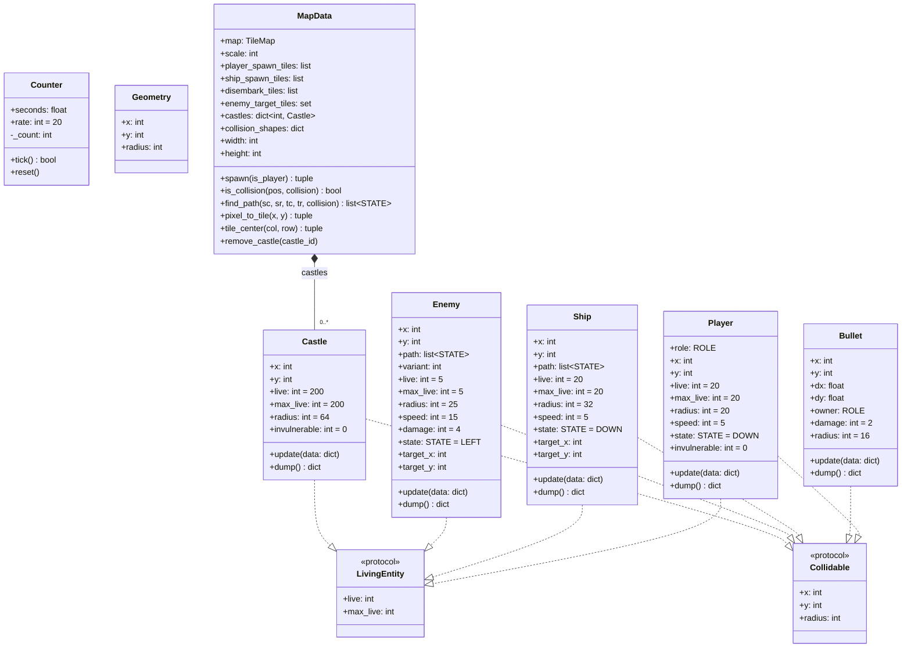
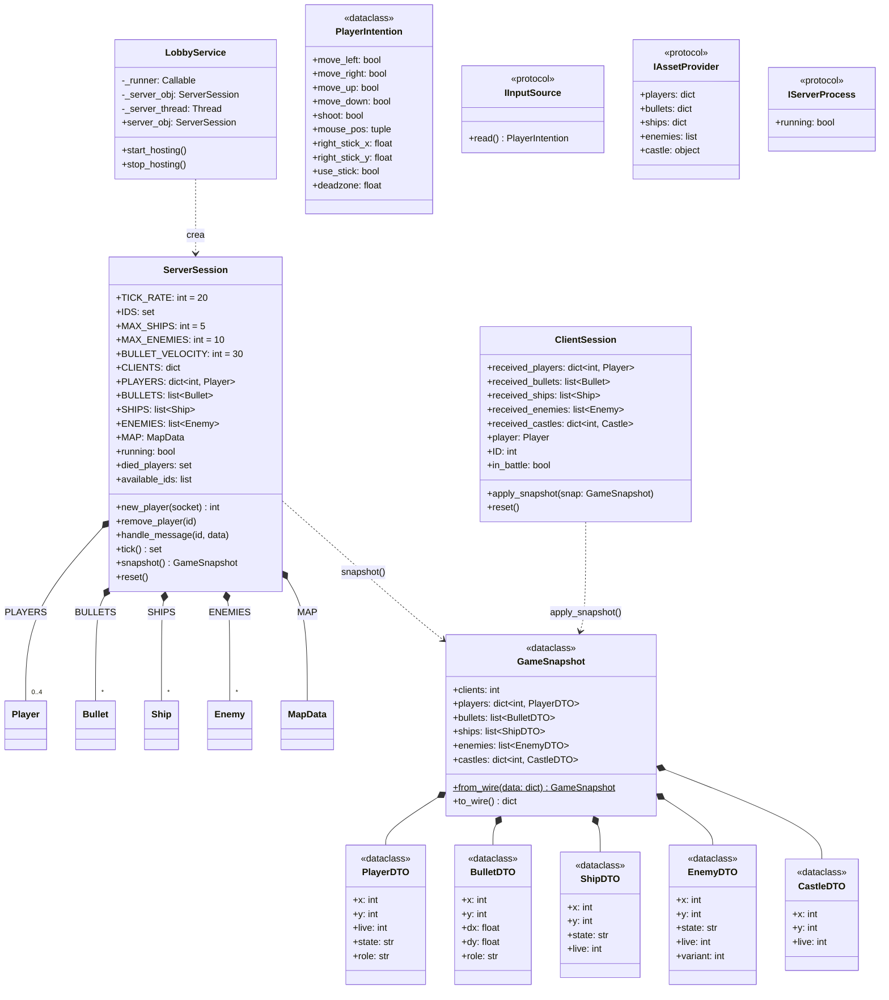
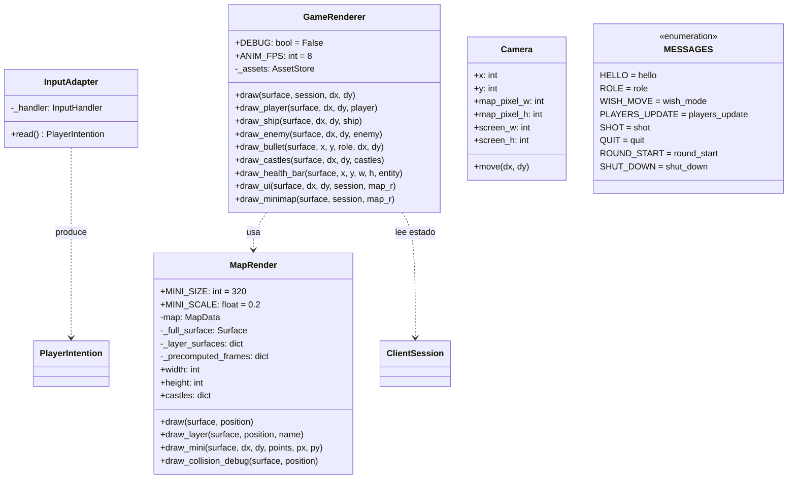
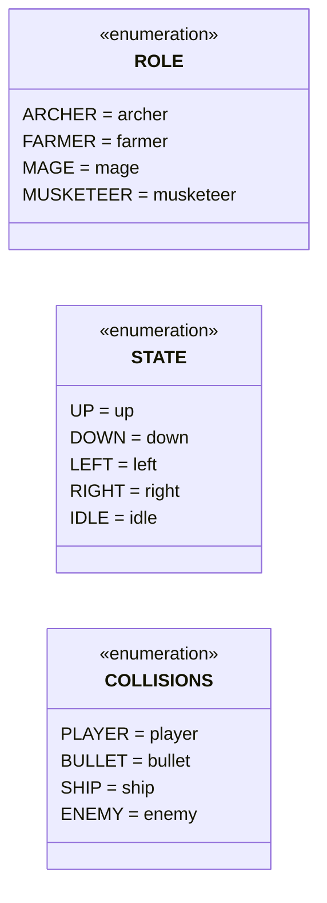

# Diagramas de Clases

El proyecto sigue **Clean Architecture** en cuatro capas. La regla central: las capas internas nunca importan las externas. `domain/` y `use_cases/` tienen cero imports de `pygame`, `asyncio` ni `websockets`.

```
[ Frameworks & Drivers ]  →  [ Interface Adapters ]  →  [ Use Cases ]  →  [ Domain ]
  pygame, asyncio,             renderers, input          ServerSession,    entities,
  websockets, asset_store,     adapters, serializers,    ClientSession,    map_data,
  ws_runner, inputs            messages, camera          LobbyService      rules puras
```

---

## Visión global por capas

```mermaid
flowchart TB
    subgraph FW["Frameworks & Drivers"]
        direction LR
        AS[AssetStore\nsingleton sprites]
        WSR[ws_runner\nasyncio + websockets]
        IH[InputHandler\nteclado / mando]
        LOBBY_SH[lobby.Screen\npygame_gui]
        GAME_SH[game.Game\nbucle async]
    end

    subgraph AD["Interface Adapters"]
        direction LR
        MSG[messages.py\nJSON builders]
        WSSH[ws_server_handler\nhandle_client async]
        IA[InputAdapter\nInputHandler→PlayerIntention]
        CAM[Camera]
        GR[GameRenderer\ndraw_*]
        MR[MapRender\ntiles + minimap]
    end

    subgraph UC["Use Cases"]
        direction LR
        SS[ServerSession\ntick / snapshot]
        CS[ClientSession\napply_snapshot]
        LS[LobbyService\nstart_hosting]
        IT[input_translator\ntranslate_move / translate_shoot]
        DTOS[dtos.py\nGameSnapshot / DTOs]
        PORTS[ports.py\nIInputSource / IAssetProvider]
    end

    subgraph DOM["Domain"]
        direction LR
        ENT["Player · Bullet · Ship\nEnemy · Castle · Counter · Geometry"]
        MD[MapData\nKDTree + A*]
        RUL[rules.py\ncheck_intersection]
        ENUMS[enums.py\nROLE · STATE · COLLISIONS]
        PROTO[protocols.py\nLivingEntity · Collidable]
    end

    FW --> AD --> UC --> DOM
```



---

## Domain

Entidades puras sin dependencias externas. Contienen solo lógica de datos y reglas de negocio.



---

## Use Cases

Orquestadores de negocio. Sin imports de `pygame`, `asyncio` ni `websockets`.



---

## Interface Adapters

Traducen entre el mundo externo (JSON, pygame, websockets) y los use cases.



---

## Enumeraciones


