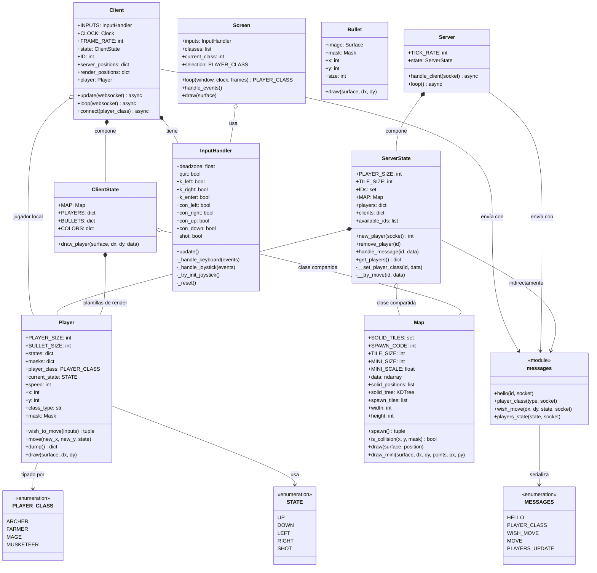
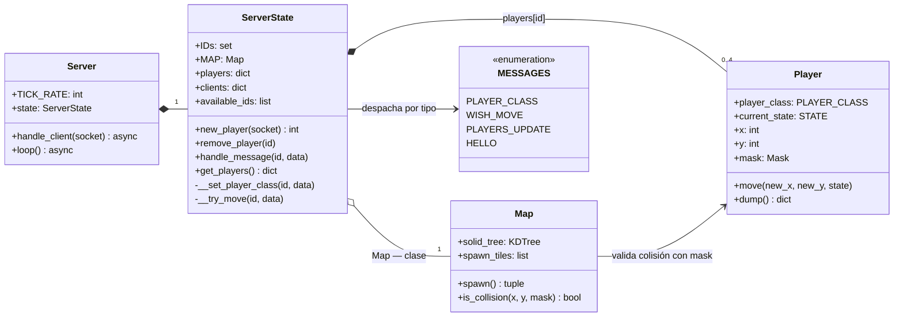
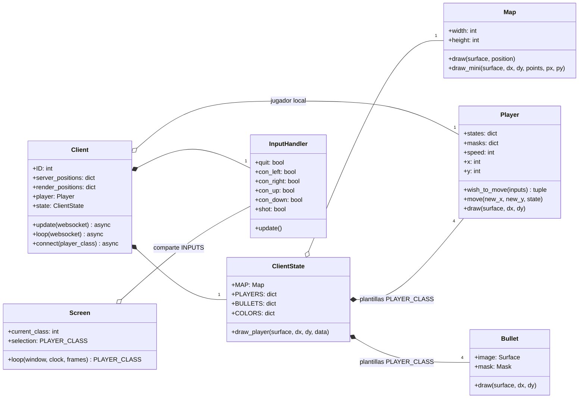
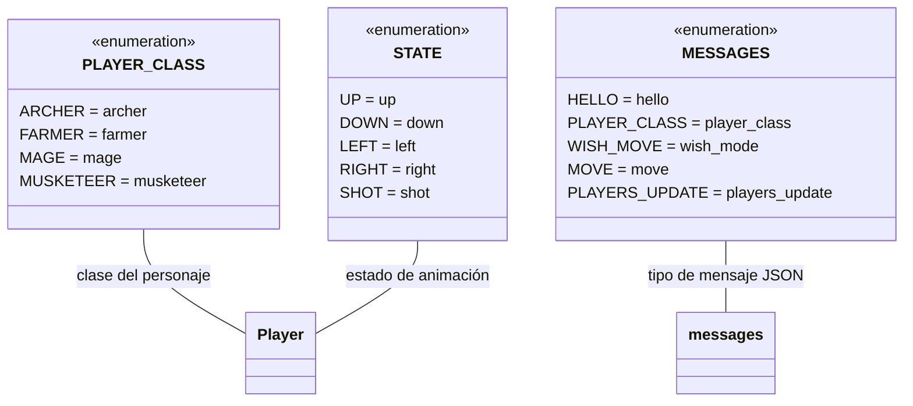

# Diagramas de Clases

## Diagrama completo del sistema

Visión global de todas las clases, sus atributos, métodos y relaciones.

---

## Lado servidor

Foco en las clases que corren en `server.py`.

---

## Lado cliente

Foco en las clases que corren en `client.py`.

---

## Enumeraciones

