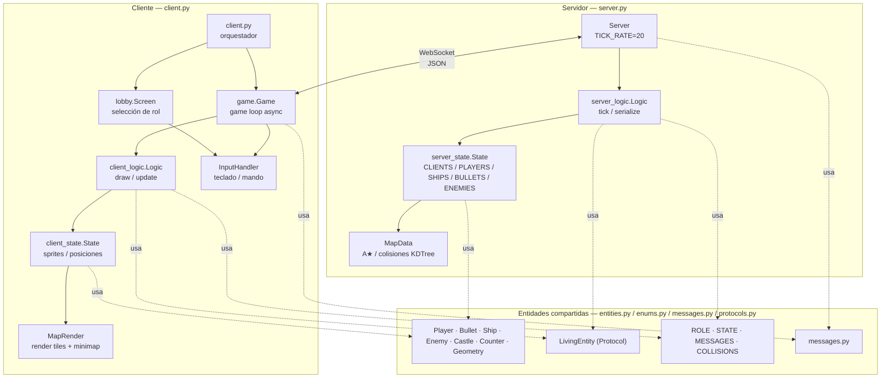
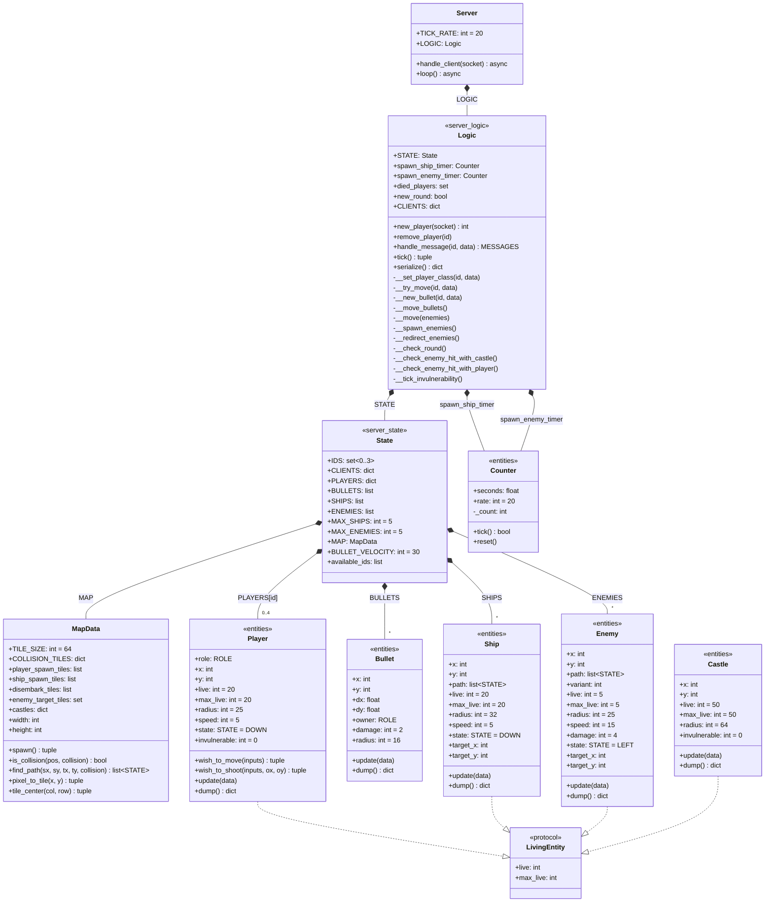
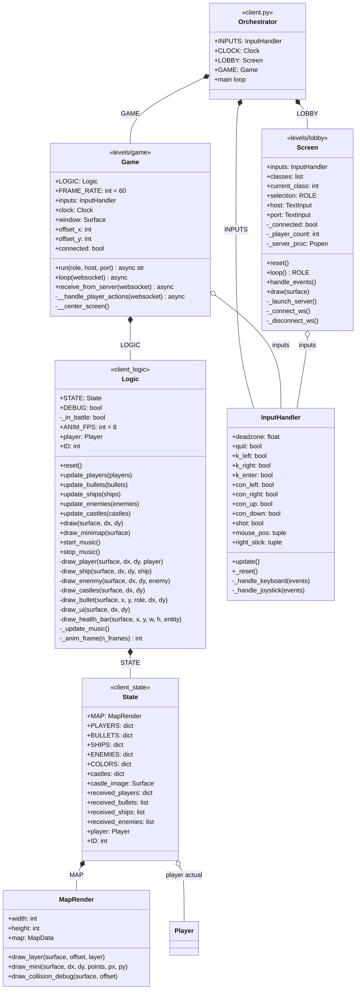
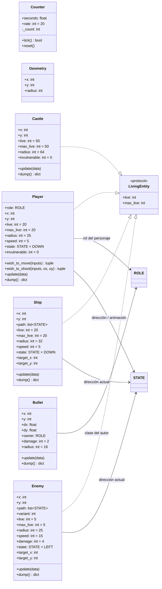
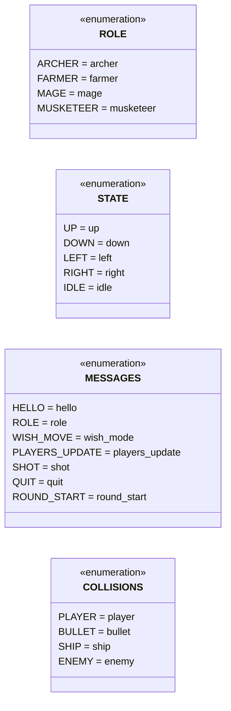

# Diagramas de Clases

## Diagrama global del sistema

Visión de alto nivel: qué módulos/clases pertenecen al servidor, al cliente, y cuáles son compartidos.

---

## Lado servidor

Clases que corren en `server.py`. La lógica de juego está separada en `Logic` (comportamiento) y `State` (datos).

---

## Lado cliente

Clases que corren en `client.py`. El orquestador (`client.py`) alterna entre lobby (síncrono) y game loop (async WebSocket).

---

## Entidades compartidas

Dataclasses definidas en `entities.py` y protocol en `protocols.py`. Son usadas tanto por el servidor (lógica autoritativa) como por el cliente (render).

---

## Enumeraciones

