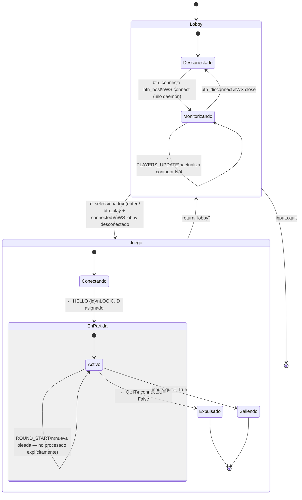
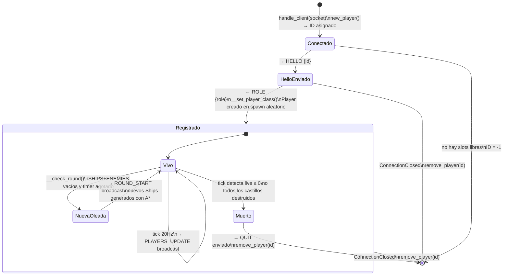
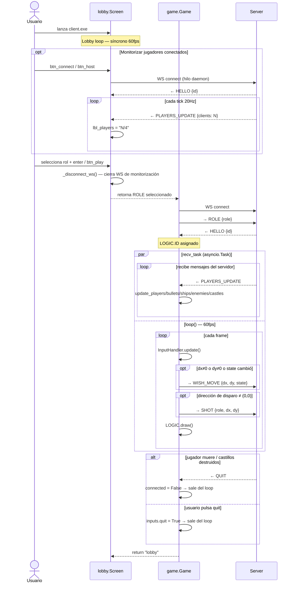

# Diagrama de Estados y Condiciones de Mensajes

Esta página muestra los **estados por los que pasan el cliente y el servidor**, y bajo qué condiciones exactas se envía cada mensaje WebSocket — tanto en la fase de **Lobby** como en la de **Juego**.

---

## Estados del cliente

!!! note "ROLE se envía antes de recibir HELLO"
    En `game.py`, el cliente envía `ROLE` **inmediatamente** al establecer la conexión, sin esperar a recibir `HELLO`. El servidor asigna el ID al aceptar la conexión, por lo que el `ROLE` siempre llega cuando el jugador ya está registrado internamente.

---

## Estados del servidor por cliente

---

## Condiciones de disparo por mensaje

| Mensaje | Dirección | Fase | Condición exacta |
|---|---|---|---|
| `HELLO` | S → C | Juego | Al aceptar nueva conexión WS en `handle_client` |
| `ROLE` | C → S | Juego | Al conectar, antes de recibir `HELLO` (`game.run`) |
| `WISH_MOVE` | C → S | Juego | Cada frame si `dx≠0` ó `dy≠0` ó `state` cambió respecto al último enviado |
| `SHOT` | C → S | Juego | Cada frame si `(dx, dy) ≠ (0, 0)` tras calcular dirección de disparo |
| `PLAYERS_UPDATE` | S → C (broadcast) | Juego | Cada tick (20Hz) si hay al menos 1 cliente conectado |
| `ROUND_START` | S → C (broadcast) | Juego | Cuando `__check_round()` genera una nueva oleada de barcos |
| `QUIT` | S → C | Juego | Cuando `tick()` detecta que un jugador murió (`live ≤ 0`) o todos los castillos cayeron |
| `PLAYERS_UPDATE` | S → C | Lobby | Cada tick (20Hz) — el lobby lo consume solo para leer `clients` (contador) |

---

## Flujo completo Lobby → Juego

---

## Tabla resumen de mensajes en Lobby vs Juego

| Mensaje | En Lobby | En Juego |
|---|:---:|:---:|
| `HELLO` | Recibido (ignorado) | Recibido → asigna ID |
| `ROLE` | — | Enviado al conectar |
| `WISH_MOVE` | — | Enviado cada frame (condicional) |
| `SHOT` | — | Enviado cada frame (condicional) |
| `PLAYERS_UPDATE` | Recibido → solo lee `clients` | Recibido → actualiza toda la escena |
| `ROUND_START` | — | Recibido (no procesado explícitamente) |
| `QUIT` | — | Recibido → termina partida |
