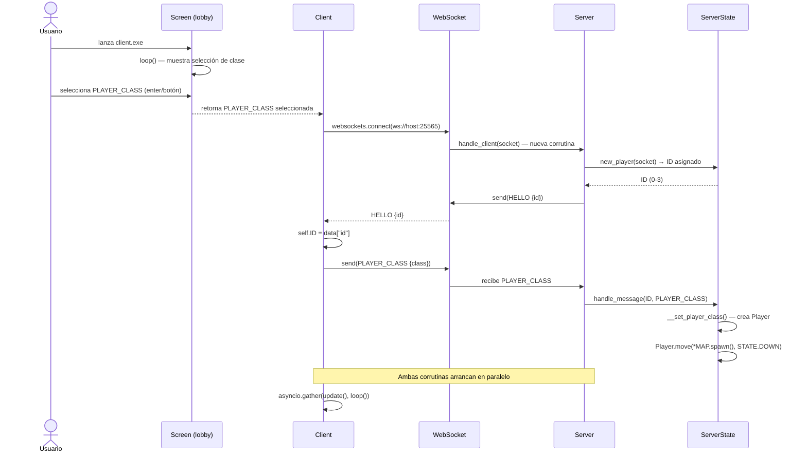
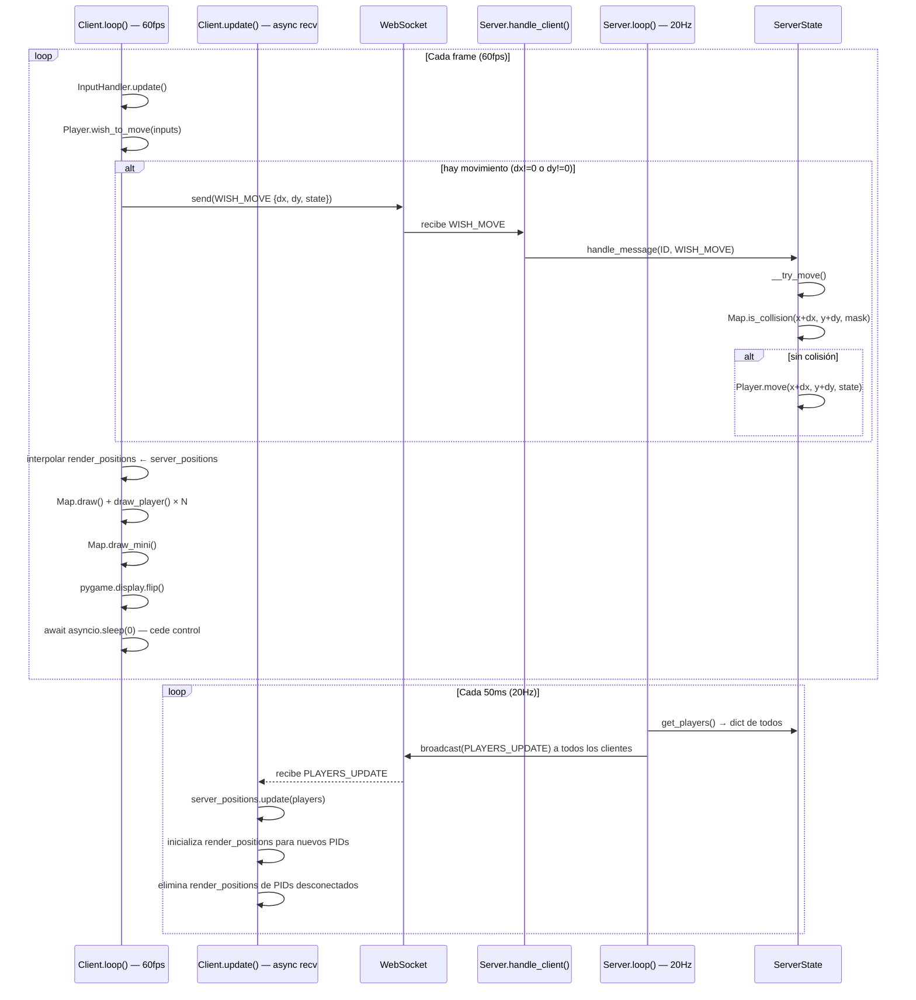
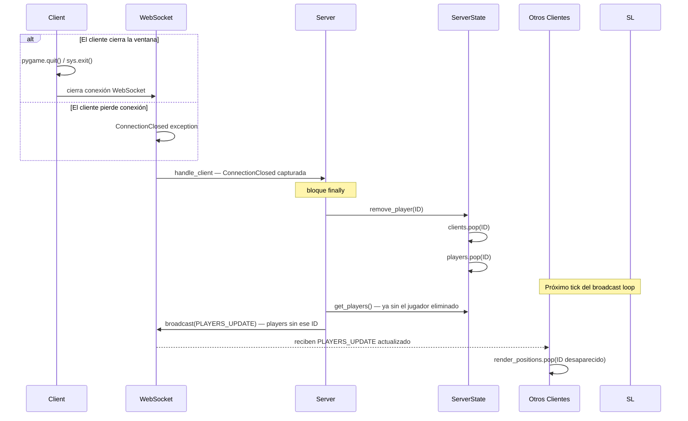
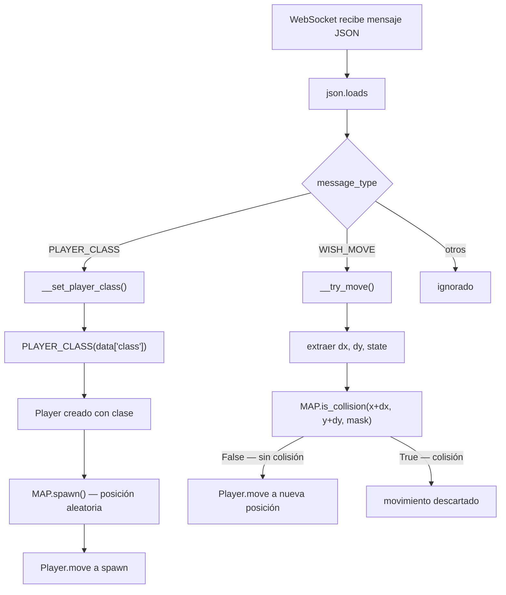

# Paso de Mensajes

Toda la comunicación entre cliente y servidor se realiza mediante **WebSockets** con mensajes **JSON**.
Cada mensaje incluye un campo `"type"` que corresponde a un valor de la enum `MESSAGES`.

---

## Catálogo de mensajes

| `type` (enum) | Valor JSON | Dirección | Descripción |
|---|---|---|---|
| `MESSAGES.HELLO` | `"hello"` | Servidor → Cliente | Asigna ID al cliente recién conectado |
| `MESSAGES.PLAYER_CLASS` | `"player_class"` | Cliente → Servidor | Notifica la clase elegida en el lobby |
| `MESSAGES.WISH_MOVE` | `"wish_mode"` | Cliente → Servidor | Solicita mover al jugador (delta + estado) |
| `MESSAGES.PLAYERS_UPDATE` | `"players_update"` | Servidor → todos | Snapshot de posiciones de todos los jugadores |
| `MESSAGES.MOVE` | `"move"` | — | Definido, no usado actualmente |

### Formato JSON de cada mensaje

=== "HELLO"
    ```json
    {
      "type": "hello",
      "id": 2
    }
    ```

=== "PLAYER_CLASS"
    ```json
    {
      "type": "player_class",
      "class": "mage"
    }
    ```

=== "WISH_MOVE"
    ```json
    {
      "type": "wish_mode",
      "dx": -5,
      "dy": 0,
      "state": "left"
    }
    ```

=== "PLAYERS_UPDATE"
    ```json
    {
      "type": "players_update",
      "players": {
        "0": { "x": 320, "y": 192, "state": "down", "type_class": "archer" },
        "2": { "x": 640, "y": 448, "state": "right", "type_class": "mage" }
      }
    }
    ```

---

## Secuencia: conexión e inicio de partida

Flujo completo desde que el usuario lanza `client.exe` hasta que entra en el game loop.



---

## Secuencia: game loop (estado estable)

Muestra la comunicación bidireccional asíncrona durante la partida.



---

## Secuencia: desconexión de un cliente



---

## Flujo de despacho de mensajes en el servidor

