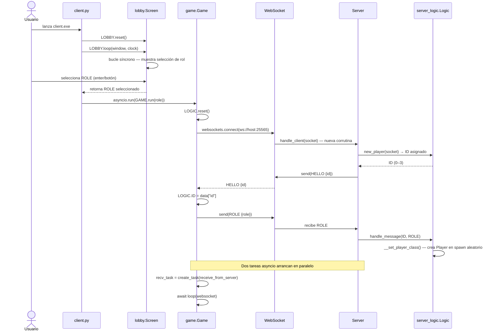
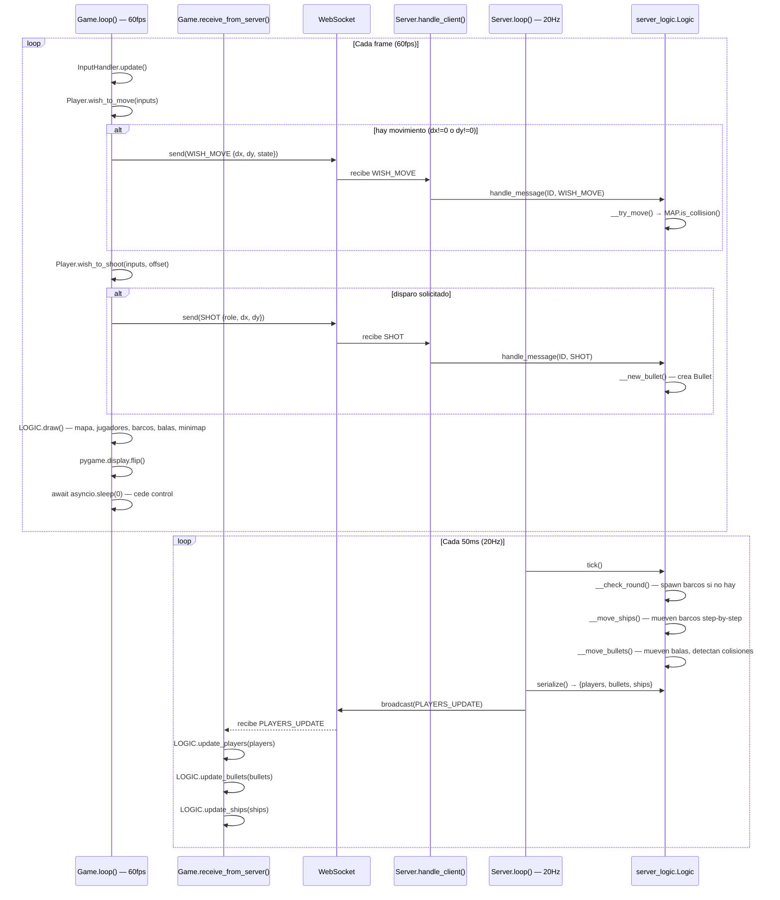
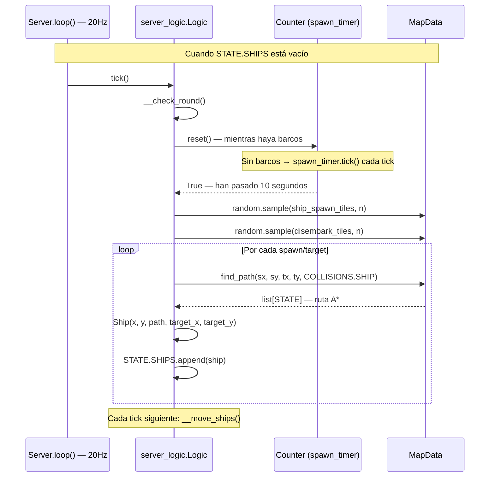
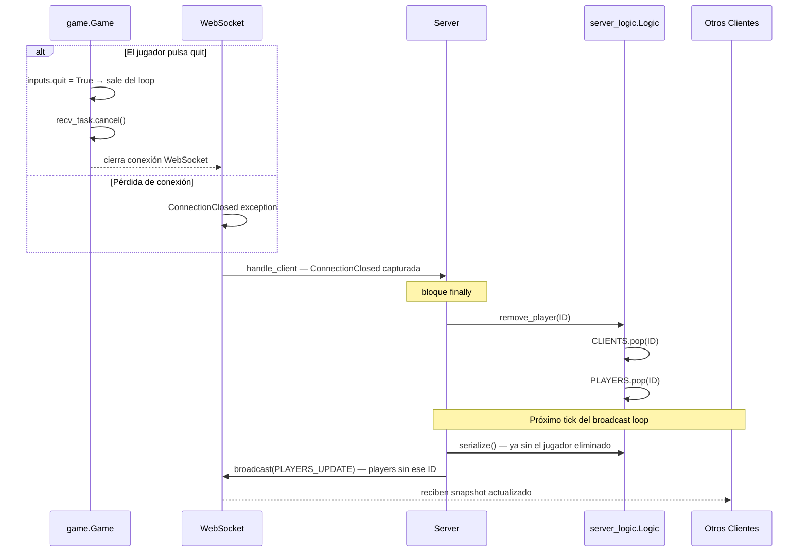
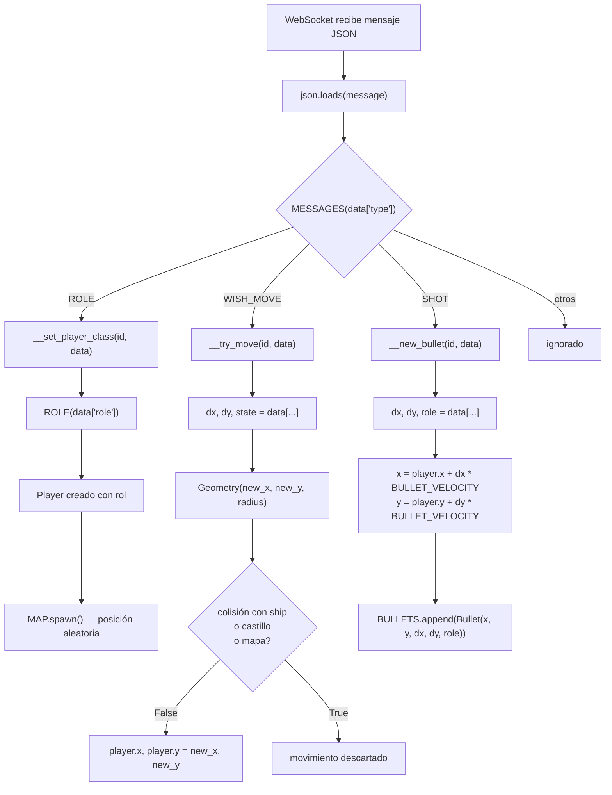
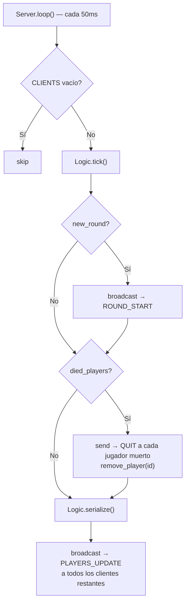
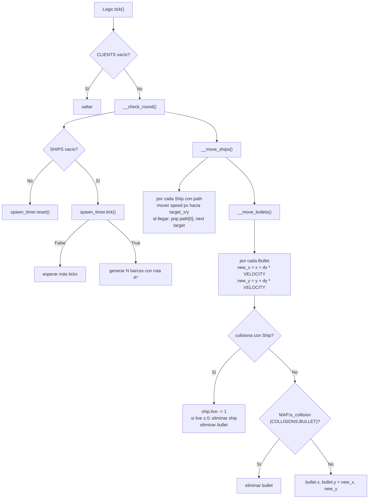

# Paso de Mensajes

Toda la comunicación entre cliente y servidor se realiza mediante **WebSockets** con mensajes **JSON**.
Cada mensaje incluye un campo `"type"` que corresponde a un valor de la enum `MESSAGES`.

---

## Catálogo de mensajes

| `type` (enum) | Valor JSON | Dirección | Descripción |
|---|---|---|---|
| `MESSAGES.HELLO` | `"hello"` | Servidor → Cliente | Asigna ID al cliente recién conectado |
| `MESSAGES.ROLE` | `"role"` | Cliente → Servidor | Notifica el rol elegido; enviado al conectar, antes de recibir `HELLO` |
| `MESSAGES.WISH_MOVE` | `"wish_mode"` | Cliente → Servidor | Solicita mover al jugador (delta + estado); solo si hay movimiento o cambio de estado |
| `MESSAGES.SHOT` | `"shot"` | Cliente → Servidor | Solicita disparar una bala (dirección normalizada ≠ 0) |
| `MESSAGES.PLAYERS_UPDATE` | `"players_update"` | Servidor → todos | Snapshot completo: jugadores, balas, barcos, enemigos y castillos (20Hz) |
| `MESSAGES.ROUND_START` | `"round_start"` | Servidor → todos | Nueva oleada generada; enviado cuando `__check_round()` spawna barcos |
| `MESSAGES.QUIT` | `"quit"` | Servidor → Cliente | El jugador es expulsado (murió o todos los castillos cayeron) |

### Formato JSON de cada mensaje

=== "HELLO"
    ```json
    {
      "type": "hello",
      "id": 2
    }
    ```

=== "ROLE"
    ```json
    {
      "type": "role",
      "role": "mage"
    }
    ```

=== "WISH_MOVE"
    ```json
    {
      "type": "wish_mode",
      "dx": -5,
      "dy": 0,
      "state": "left"
    }
    ```

=== "SHOT"
    ```json
    {
      "type": "shot",
      "role": "archer",
      "dx": 0.707,
      "dy": -0.707
    }
    ```

=== "PLAYERS_UPDATE"
    ```json
    {
      "type": "players_update",
      "clients": 2,
      "players": {
        "0": { "x": 320, "y": 192, "state": "down", "role": "archer", "live": 10, "radius": 32 },
        "2": { "x": 640, "y": 448, "state": "right", "role": "mage",   "live": 10, "radius": 32 }
      },
      "bullets": [
        { "x": 400, "y": 200, "dx": 0.707, "dy": -0.707, "role": "archer" }
      ],
      "ships": [
        { "x": 960, "y": 320, "state": "left" }
      ],
      "enemies": [
        { "x": 800, "y": 400, "state": "down", "variant": 1 }
      ],
      "castles": {
        "0": { "x": 256, "y": 256, "live": 5 }
      }
    }
    ```

=== "ROUND_START"
    ```json
    {
      "type": "round_start"
    }
    ```

=== "QUIT"
    ```json
    {
      "type": "quit"
    }
    ```

---

## Secuencia: conexión e inicio de partida

Flujo completo desde que el usuario lanza `client.exe` hasta que entra en el game loop.



---

## Secuencia: game loop (estado estable)

Muestra la comunicación bidireccional asíncrona durante la partida.



---

## Secuencia: spawn de barcos

Flujo que ocurre automáticamente en el servidor cuando no quedan barcos en juego.



---

## Secuencia: desconexión de un cliente



---

## Flujo de despacho de mensajes en el servidor



### Mensajes enviados por el servidor (salientes)



---

## Flujo de tick del servidor (20Hz)


