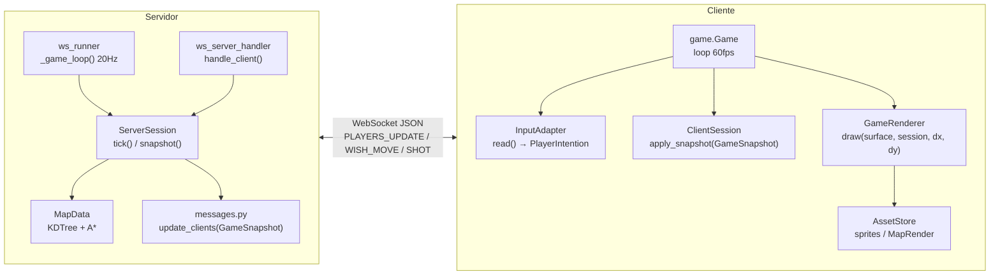
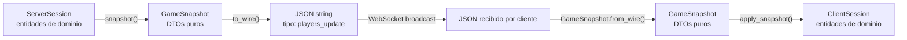
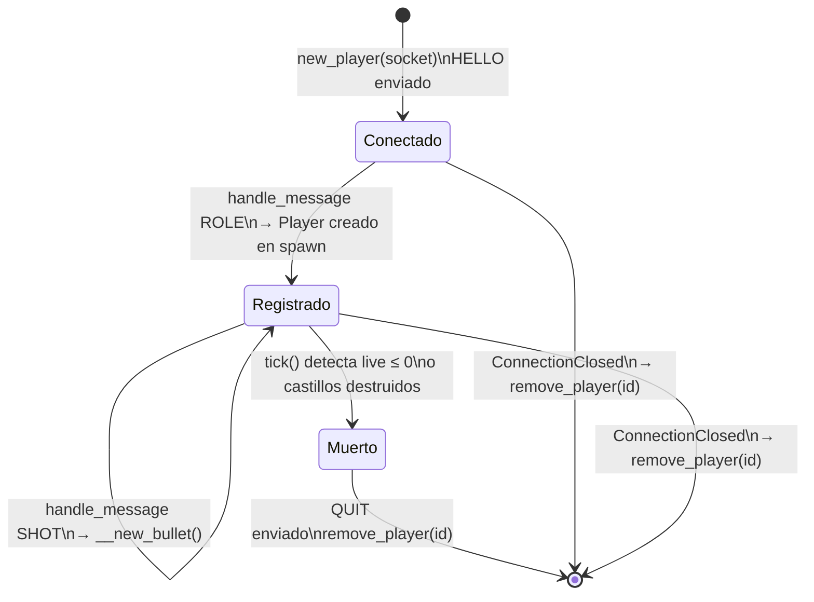
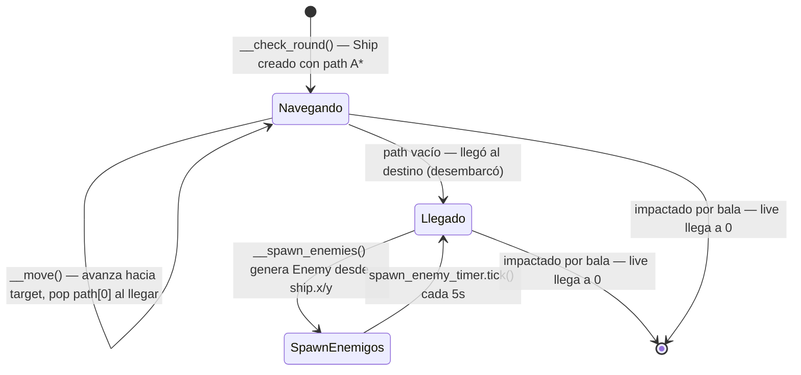
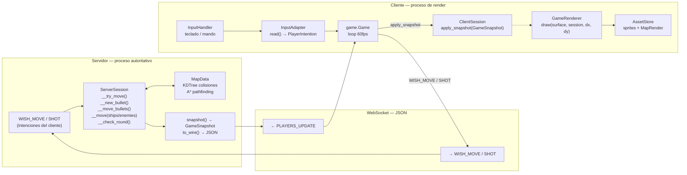
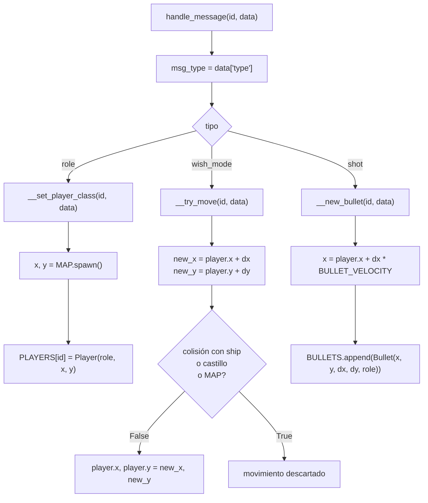
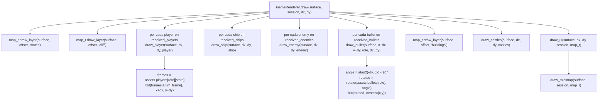

# Servidor vs Cliente

El proyecto separa la lógica en dos procesos independientes que se comunican exclusivamente por WebSocket.
Cada lado está organizado en capas Clean Architecture: el servidor corre `ServerSession` (use_cases) orquestado por `ws_runner` (frameworks); el cliente corre `ClientSession` + `GameRenderer` (use_cases + adapters) orquestado por `game.Game` (frameworks).

---

## Resumen de responsabilidades

| Aspecto | Servidor | Cliente |
|---|---|---|
| **Entry point** | `server.py` → `ws_runner.run()` | `main.py` → `game.Game.run()` |
| **Fuente de verdad** | Sí — `ServerSession` tiene posiciones canónicas | No — recibe `GameSnapshot` del servidor |
| **Mapa** | `MapData` — valida colisiones, A* | `MapRender` — renderiza tiles y minimap |
| **Jugadores** | `dict[id → Player]` con posición real | `ClientSession.received_players` |
| **Balas** | Mueve, detecta colisiones y elimina | Dibuja rotadas según dirección |
| **Barcos** | Pathfinding A*, movimiento suave, vida | Dibuja según `state` (dirección) |
| **Conexiones WS** | `ServerSession.CLIENTS: dict[id → socket]` | — |
| **Input** | Nunca toca inputs | `InputHandler` → `InputAdapter` → `PlayerIntention` |
| **Pygame / render** | No renderiza nada | `GameRenderer` dibuja todo a 60fps |
| **Tick rate** | 20Hz — broadcast + física | 60fps — render + envío de intenciones |
| **DTOs** | `snapshot() → GameSnapshot` | `apply_snapshot(GameSnapshot)` |

---

## Separación por capas (lado servidor vs cliente)

---

## Flujo de datos: GameSnapshot

El snapshot es el objeto que cruza la frontera entre servidor y cliente. Es el único punto de acoplamiento entre ambos lados.

---

## MapData (servidor) vs MapRender (cliente)

El mapa se carga dos veces, con responsabilidades distintas:

| Aspecto | `MapData` | `MapRender` |
|---|---|---|
| **Capa** | `domain/map_data.py` | `adapters/renderer.py` |
| **Usado en** | `ServerSession` | `AssetStore` → `GameRenderer` |
| **Parser** | `tiledpy.Parser.load()` → `TileMap` | `MapData` + `tiledpy.map.render` |
| **Colisiones** | `KDTree` por tipo (`COLLISIONS`) | — |
| **Pathfinding** | A* sobre grid de tiles | — |
| **Spawn tiles** | Player spawn, ship spawn, disembark | — |
| **Render tiles** | — | `pygame.Surface` precalculada por capa |
| **Minimap** | — | Versión escalada al 20% + máscara circular |
| **Capas animadas** | — | Precomputa frames por `tick_ms` con `gcd` |

---

## Ciclo de vida de un jugador en el servidor

---

## Ciclo de vida de un barco

---

## Flujo completo de datos (partida en curso)

---

## ServerSession — detalle de `handle_message`

---

## GameRenderer — flujo de render

---

## Tabla de responsabilidades detallada

| Operación | `ServerSession` | `ClientSession` | `GameRenderer` | `AssetStore` |
|---|:---:|:---:|:---:|:---:|
| Almacenar posiciones canónicas | ✓ | | | |
| Validar colisiones con mapa | ✓ | | | |
| Pathfinding A* | ✓ | | | |
| Mover barcos y enemigos | ✓ | | | |
| Mover balas | ✓ | | | |
| Spawn de entidades | ✓ | | | |
| Gestionar conexiones WS | ✓ | | | |
| Serializar estado → GameSnapshot | ✓ | | | |
| Almacenar snapshots recibidos | | ✓ | | |
| Aplicar GameSnapshot del servidor | | ✓ | | |
| Almacenar sprites / MapRender | | | | ✓ |
| Renderizar mapa por capas | | | ✓ | |
| Renderizar jugadores / barcos / balas | | | ✓ | |
| Renderizar HUD y minimap | | | ✓ | |
| Procesar input | | | | |
