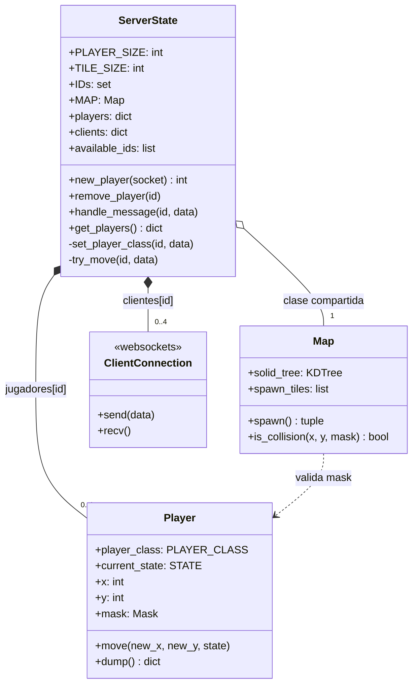
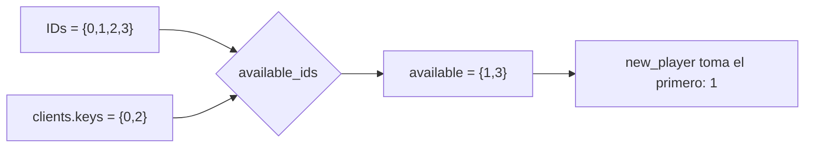
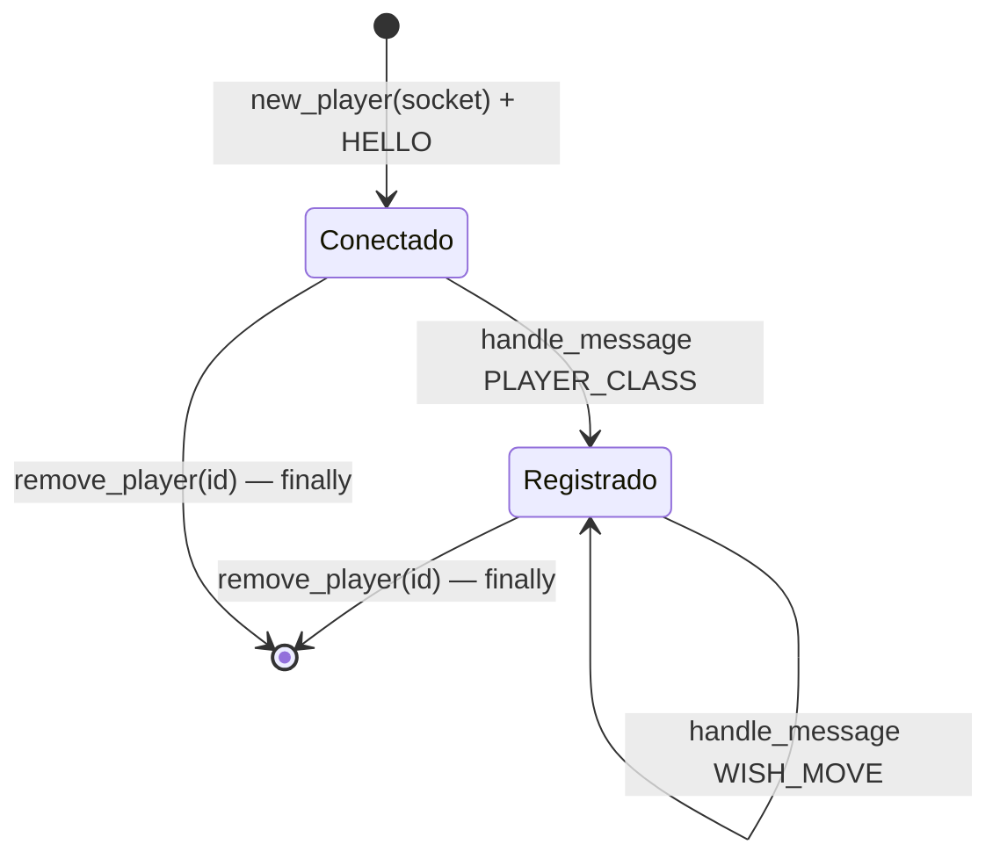
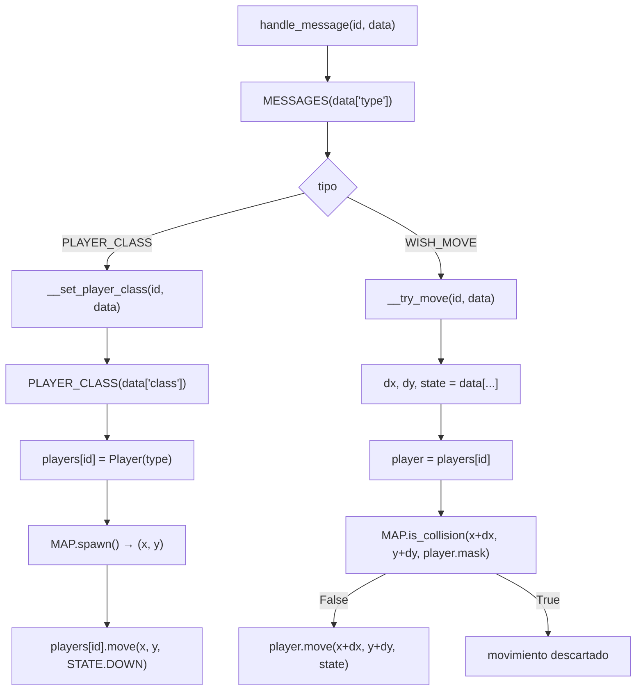
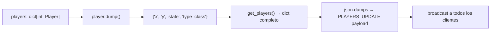
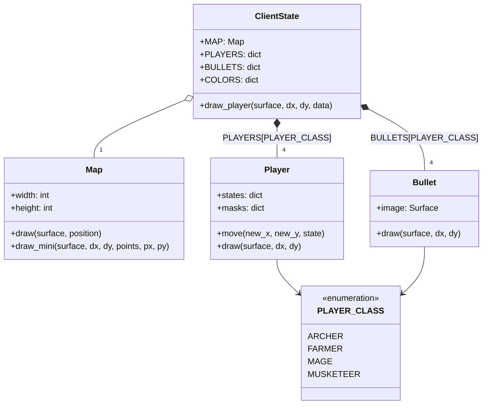
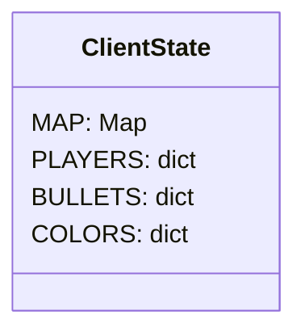
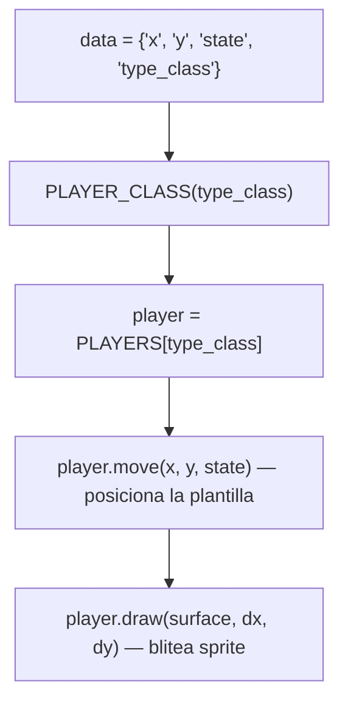
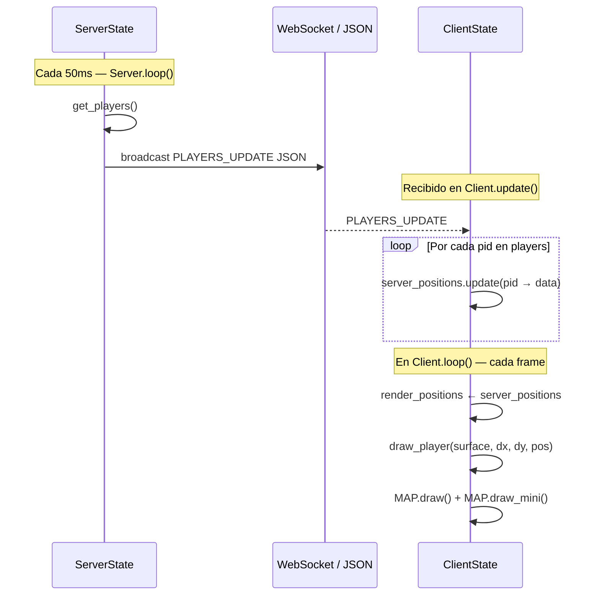
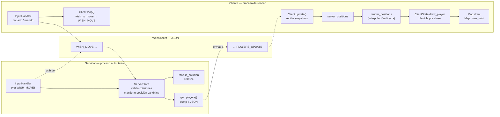

# ServerState & ClientState

`ServerState` y `ClientState` son las dos clases centrales del proyecto.
Ambas viven en `src/states.py` y representan la **división de responsabilidades** entre la lógica autoritativa del servidor y el estado de renderizado del cliente.

---

## Resumen de responsabilidades

| Aspecto | `ServerState` | `ClientState` |
|---|---|---|
| **Proceso** | `server.py` | `client.py` |
| **Fuente de verdad** | Sí — posiciones canónicas | No — recibe datos del servidor |
| **Mapa** | Valida colisiones | Solo renderiza |
| **Jugadores** | `dict[id → Player]` con estado real | Plantillas por clase para dibujar |
| **Conexiones** | `dict[id → ClientConnection]` | — |
| **Input** | Nunca toca inputs | Indirecto via `Client` |
| **Pygame** | No renderiza nada | Dibuja todo en pantalla |
| **Mutación de Player** | `Player.move()` si válido | `player.move()` solo para posicionar sprite |

---

## ServerState — diseño en profundidad

### Diagrama de clases de ServerState



### Gestión de IDs

`ServerState` mantiene un pool fijo de IDs `{0, 1, 2, 3}` (máximo 4 jugadores).
La propiedad `available_ids` calcula la diferencia entre el pool y las claves activas de `clients`.



### Ciclo de vida de un jugador en el servidor



### Flujo de `handle_message`



### `get_players()` — serialización del estado

El broadcast loop llama a `get_players()` cada 50ms para serializar el estado completo:

```python
# Equivalente a:
{
    0: { 'x': 320, 'y': 192, 'state': 'down', 'type_class': 'archer' },
    2: { 'x': 640, 'y': 448, 'state': 'right', 'type_class': 'mage' }
}
```



---

## ClientState — diseño en profundidad

### Diagrama de clases de ClientState



### Atributos de clase vs. instancia

!!! note "Atributos de clase compartidos"
    `MAP`, `PLAYERS`, `BULLETS` y `COLORS` están definidos **a nivel de clase** (`cls`), no de instancia.
    Esto significa que se inicializan una sola vez y son compartidos si hubiera múltiples instancias de `ClientState`.



### Flujo de `draw_player`

`draw_player` recibe un dict deserializado de `PLAYERS_UPDATE` y delega en la plantilla de `Player` correcta:



!!! warning "Plantilla compartida"
    `ClientState.PLAYERS` tiene **una sola instancia de `Player` por clase**.
    Al llamar `player.move()` antes de `player.draw()` se mueve la plantilla a la posición correcta antes de dibujar.
    Esto funciona porque los jugadores se renderizan en secuencia, no en paralelo.

---

## Interacción entre ServerState y ClientState

Ambos estados nunca interactúan directamente — están en procesos distintos y se comunican **solo a través de la red**.



### Comparación de flujos de datos



---

## Tabla de responsabilidades

| Operación | `ServerState` | `ClientState` | Quién lo hace |
|---|:---:|:---:|---|
| Cargar mapa CSV | ✓ | ✓ | Ambos cargan su propia copia |
| Validar colisiones | ✓ | ✗ | Solo servidor |
| Calcular spawn | ✓ | ✗ | Solo servidor |
| Mantener posición canónica | ✓ | ✗ | Solo servidor |
| Almacenar conexiones WS | ✓ | ✗ | Solo servidor |
| Broadcast de estado | ✓ | ✗ | Solo servidor |
| Cargar sprites | ✗ | ✓ | Solo cliente |
| Renderizar mapa | ✗ | ✓ | Solo cliente |
| Renderizar jugadores | ✗ | ✓ | Solo cliente |
| Renderizar minimap | ✗ | ✓ | Solo cliente |
| Interpolar posiciones | ✗ | ✓ | Solo cliente |
| Gestionar colores minimap | ✗ | ✓ | Solo cliente |
