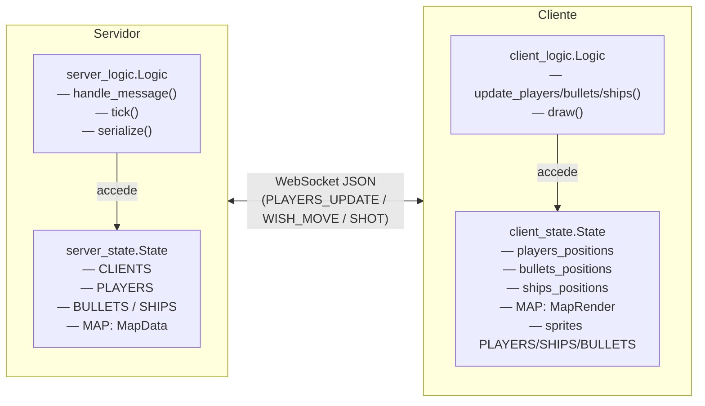
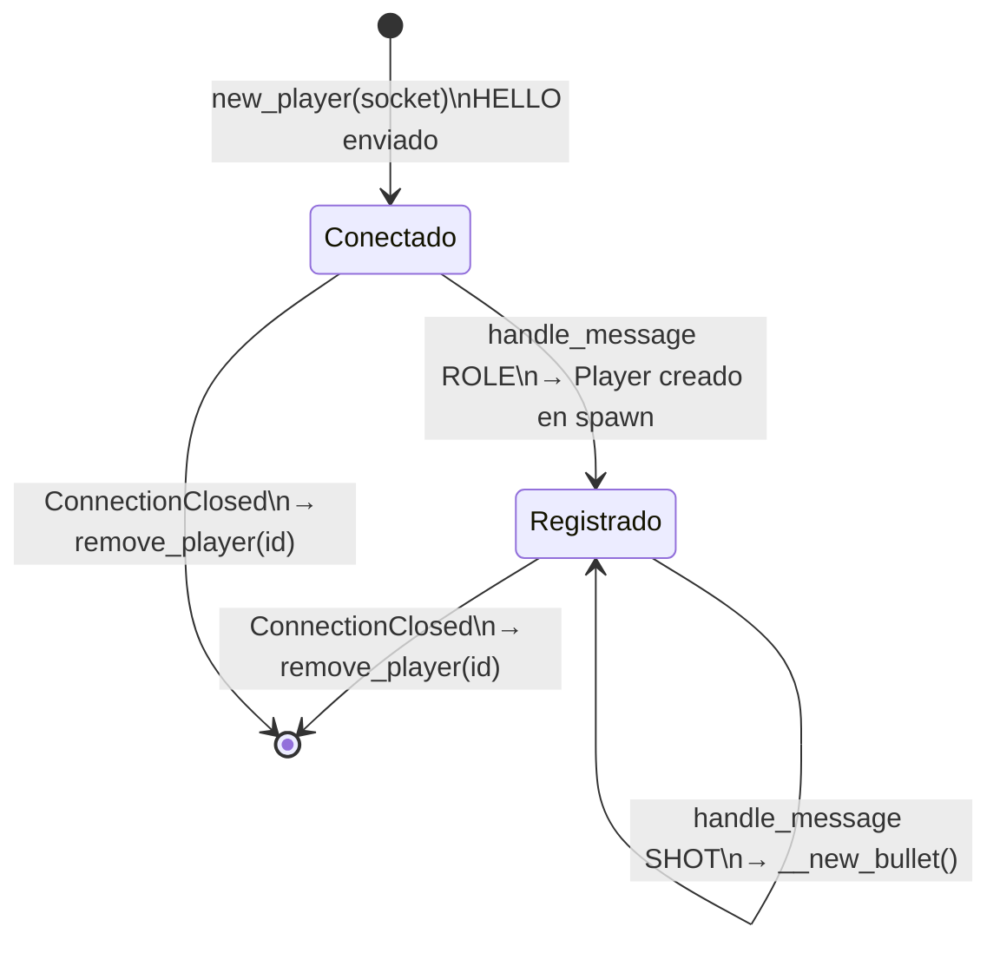
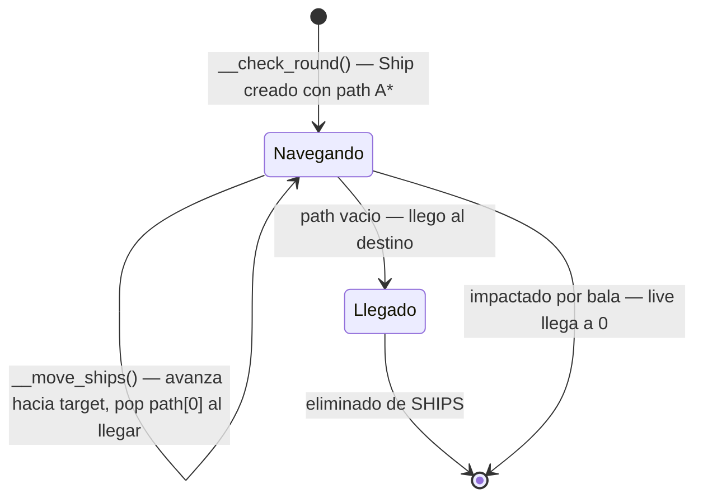
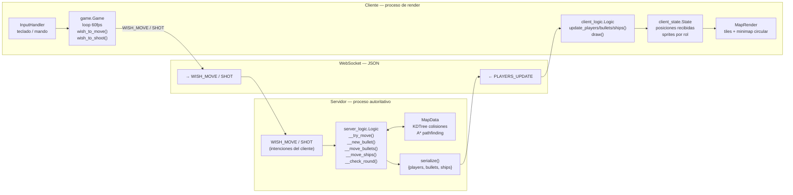
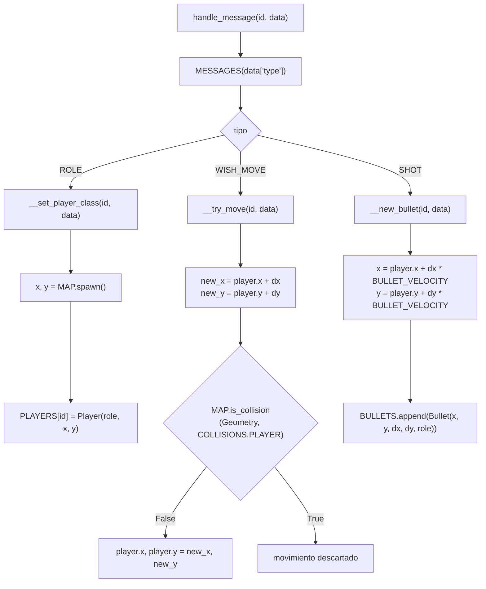
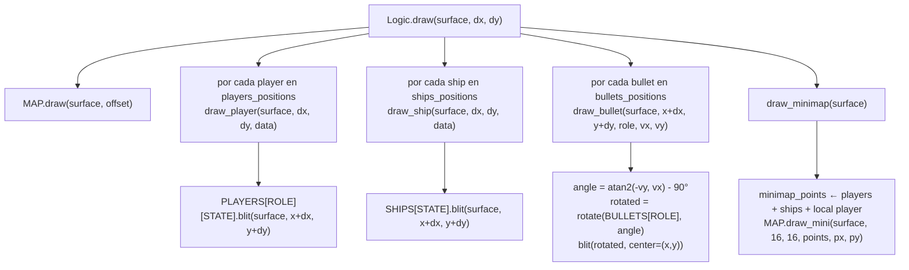
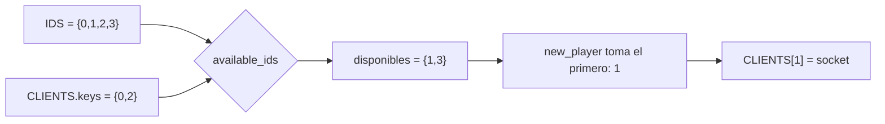

# Servidor vs Cliente

El proyecto separa la lógica en dos procesos independientes que se comunican exclusivamente por WebSocket.
Cada lado divide además sus responsabilidades entre un objeto **State** (datos) y un objeto **Logic** (comportamiento).

---

## Resumen de responsabilidades

| Aspecto | Servidor | Cliente |
|---|---|---|
| **Proceso** | `server.py` | `client.py` |
| **Fuente de verdad** | Sí — posiciones canónicas | No — recibe snapshots del servidor |
| **Mapa** | `MapData` — valida colisiones, A* | `MapRender` — renderiza tiles y minimap |
| **Jugadores** | `dict[id → Player]` con posición real | Dict de sprites por rol para dibujar |
| **Balas** | Mueve, detecta colisiones y elimina | Dibuja rotadas según dirección |
| **Barcos** | Pathfinding A*, movimiento suave, vida | Dibuja según `state` (dirección) |
| **Conexiones WS** | `dict[id → ClientConnection]` | — |
| **Input** | Nunca toca inputs | `InputHandler` teclado + mando |
| **Pygame / render** | No renderiza nada | Dibuja todo en pantalla a 60fps |
| **Tick rate** | 20Hz — broadcast + física | 60fps — render + envío de intenciones |

---

## Separación State / Logic

Tanto el servidor como el cliente separan los **datos** (State) del **comportamiento** (Logic).

---

## MapData (servidor) vs MapRender (cliente)

El mapa se carga dos veces, con responsabilidades distintas:

| Aspecto | `MapData` | `MapRender` |
|---|---|---|
| **Fichero** | `map.py` | `map.py` |
| **Usado en** | `server_state.State` | `client_state.State` |
| **Carga** | CSV con `pandas` → `ndarray` | `MapData` + sprites `pygame` |
| **Colisiones** | KDTree por tipo (`COLLISIONS`) | — |
| **Pathfinding** | A* (`find_path`) sobre grid de tiles | — |
| **Spawn tiles** | Player spawn, ship spawn, disembark | — |
| **Render tiles** | — | `pygame.Surface` precalculada |
| **Minimap** | — | Versión escalada al 10% + máscara circular |

---

## Ciclo de vida de un jugador en el servidor

---

## Ciclo de vida de un barco

---

## Flujo completo de datos (partida en curso)

---

## server_logic.Logic — detalle de `handle_message`

---

## client_logic.Logic — flujo de render

---

## Gestión de IDs en el servidor

---

## Tabla de responsabilidades detallada

| Operación | `server_state.State` | `server_logic.Logic` | `client_state.State` | `client_logic.Logic` |
|---|:---:|:---:|:---:|:---:|
| Almacenar posiciones canónicas | ✓ | | | |
| Validar colisiones | | ✓ | | |
| Pathfinding A* | | ✓ | | |
| Mover barcos | | ✓ | | |
| Mover balas | | ✓ | | |
| Spawn de entidades | | ✓ | | |
| Gestionar conexiones WS | ✓ | | | |
| Serializar estado | | ✓ | | |
| Almacenar sprites / tiles | | | ✓ | |
| Almacenar snapshots recibidos | | | ✓ | |
| Renderizar mapa | | | | ✓ |
| Renderizar jugadores / barcos / balas | | | | ✓ |
| Renderizar minimap | | | | ✓ |
| Procesar input | | | | ✓ (vía Game) |
