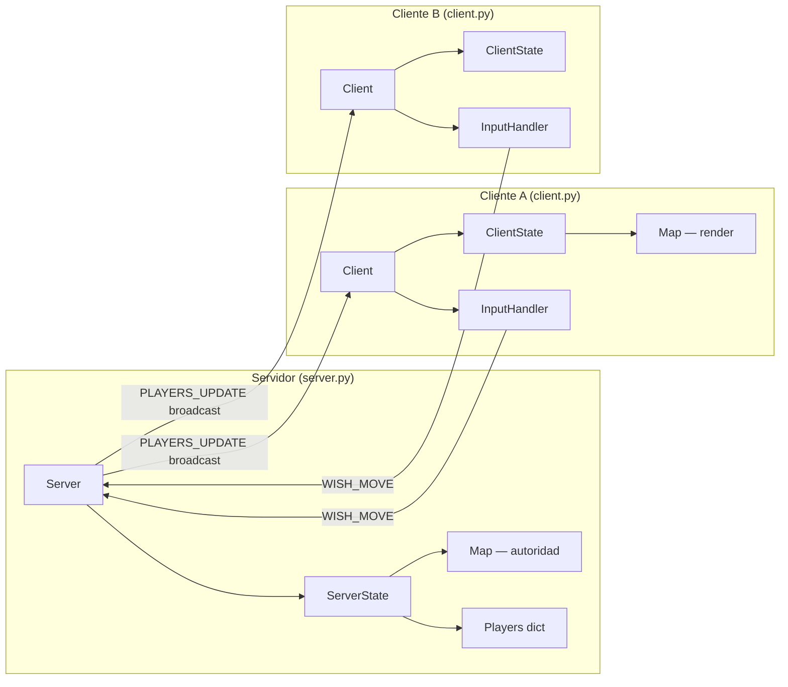
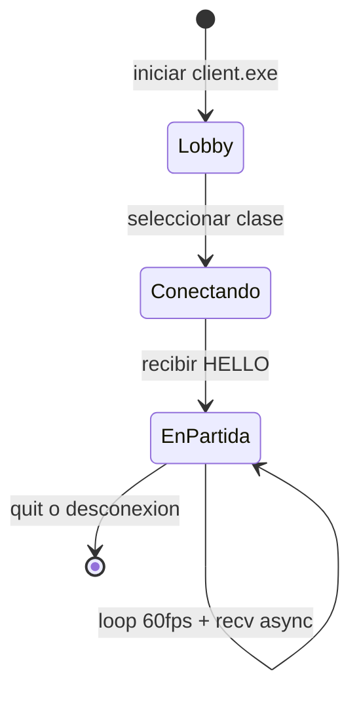

# Pygame Multi

Juego multijugador 2D en tiempo real construido con **Python + Pygame + WebSockets**.

## Stack tecnológico

| Capa | Tecnología |
|---|---|
| Renderizado | Pygame |
| Red | websockets (asyncio) |
| Servidor | Python asyncio |
| Mapa / Colisiones | Pandas (CSV) + SciPy KDTree |
| Build | PyInstaller |

## Arquitectura general

El sistema sigue un modelo **cliente-servidor autoritativo**: el servidor es la única fuente de verdad sobre las posiciones de los jugadores. Los clientes envían *intenciones* de movimiento y el servidor decide si son válidas.

## Flujo de vida de una sesión

## Módulos del proyecto

| Archivo | Responsabilidad |
|---|---|
| `server.py` | Entry-point servidor, WebSocket listener, broadcast loop |
| `client.py` | Entry-point cliente, render loop, conexión WS |
| `states.py` | `ServerState` (lógica) y `ClientState` (render) |
| `messages.py` | Funciones de serialización JSON de cada mensaje |
| `enums.py` | `PLAYER_CLASS`, `STATE`, `MESSAGES` |
| `entities/player.py` | `Player` y `Bullet` |
| `maps.py` | `Map` — carga CSV, colisiones KDTree, minimap |
| `factories.py` | Carga de sprites y tiles desde disco |
| `inputs.py` | `InputHandler` — teclado y mando |
| `levels/lobby.py` | Pantalla de selección de personaje |
| `paths.py` | Rutas de assets (compatible PyInstaller) |

## Navegación

- **[Diagramas de Clases](diagramas/clases.md)** — jerarquía completa de clases
- **[Paso de Mensajes](diagramas/mensajes.md)** — secuencias WebSocket y formato JSON
- **[ServerState & ClientState](diagramas/server-client.md)** — diseño e interacción en profundidad
