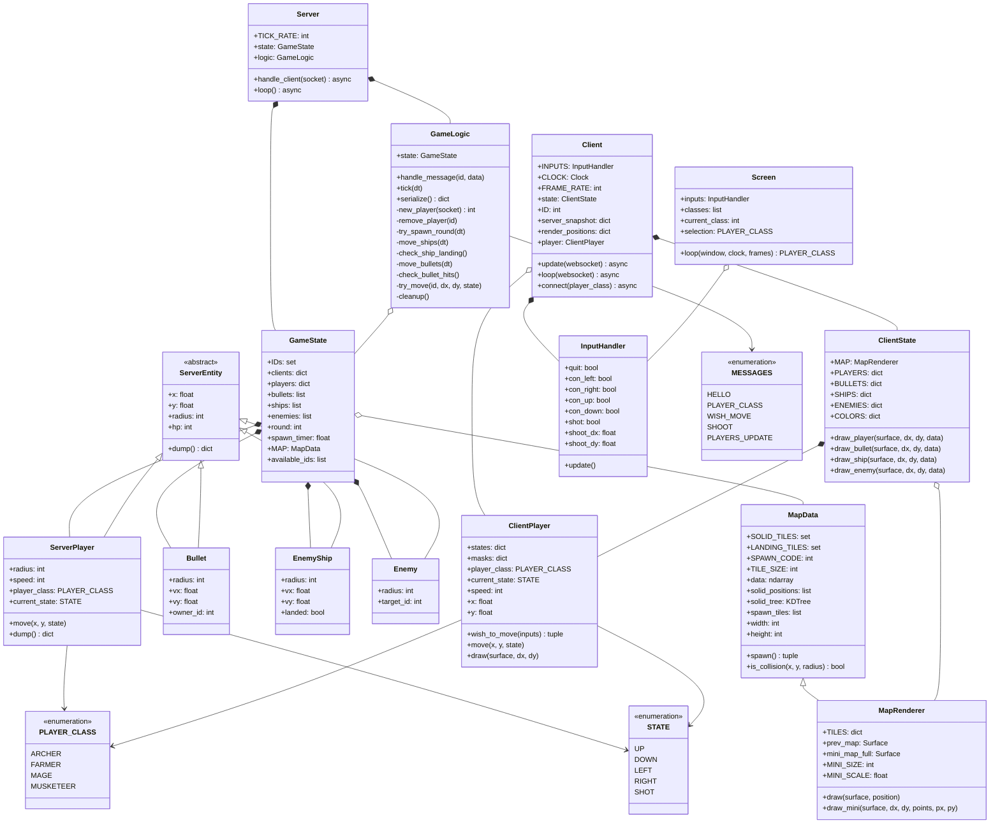
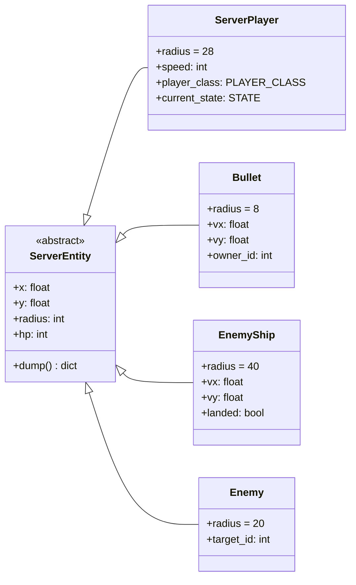
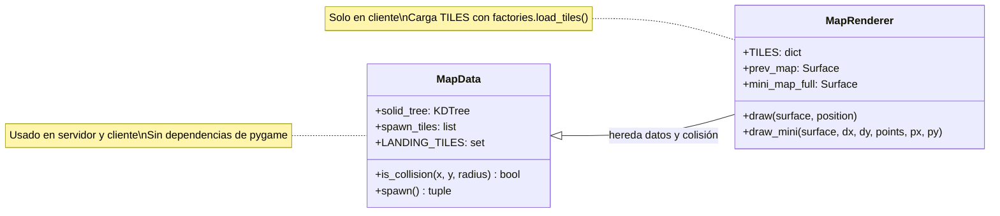
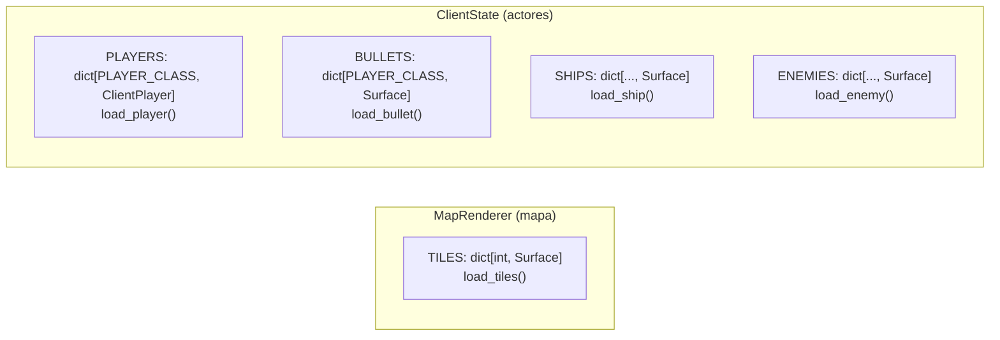
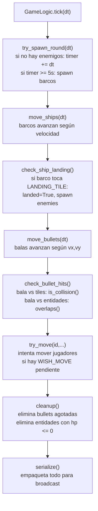

# Diagrama de clases — Propuesta

## Vista completa



---

## Jerarquía de entidades del servidor

Todas las entidades del servidor heredan de `ServerEntity`, que define
solo la geometría de colisión (sin sprites ni pygame).



La colisión entre cualquier par de entidades se resuelve con una sola función:

```python
def overlaps(a: ServerEntity, b: ServerEntity) -> bool:
    dx, dy = a.x - b.x, a.y - b.y
    return dx*dx + dy*dy <= (a.radius + b.radius) ** 2
```

---

## Split de Map: MapData vs MapRenderer



`is_collision` cambia de firma: recibe `radius: int` en lugar de `pygame.mask.Mask`,
eliminando la dependencia de sprites en el servidor.

---

## Sprites por propietario



---

## Tick del servidor — orden de operaciones


