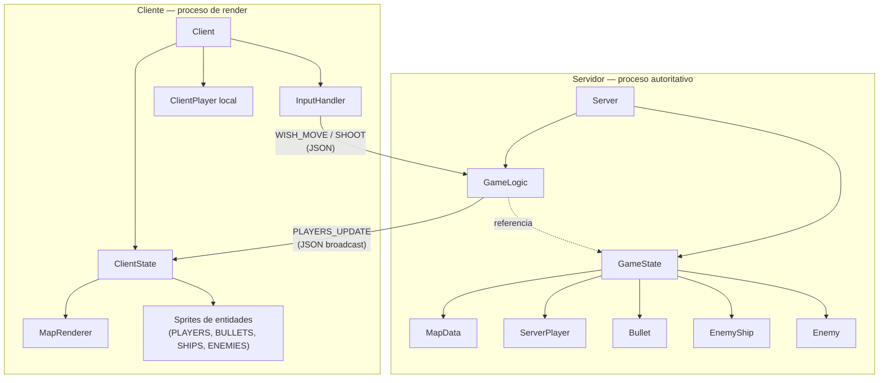

# Propuesta de arquitectura

Rediseño del servidor para soportar oleadas de enemigos, barcos, balas y rondas,
manteniendo el modelo autoritativo cliente-servidor.

---

## Motivación

La `ServerState` actual mezcla datos y lógica, y las entidades del servidor cargan
sprites de pygame innecesariamente. Con la nueva mecánica de juego (barcos, enemigos,
balas con física, rondas) eso se vuelve inmanejable.

| Problema actual | Solución propuesta |
|---|---|
| `ServerState` mezcla datos + lógica | Separar en `GameState` + `GameLogic` |
| `Player` carga sprites en el servidor | `ServerEntity` solo con geometría (radio) |
| `Map` mezcla colisión + rendering | Separar en `MapData` + `MapRenderer` |
| Sprites de entidades dispersos | `ClientState` como almacén único de sprites de actores |
| No hay enemigos ni barcos | Nuevas entidades `EnemyShip` y `Enemy` |

---

## Visión general

---

## Principio guía

!!! tip "Regla: si necesitas pygame, es solo del cliente"
    El servidor no importa `pygame` para nada. Las colisiones usan geometría
    simple (radio circular). Los sprites y máscaras viven únicamente en el cliente.

---

## Dónde viven los sprites

| Sprites | Propietario | Motivo |
|---|---|---|
| Tiles del mapa | `MapRenderer` | El mapa sabe renderizarse a sí mismo |
| Personajes jugadores | `ClientState.PLAYERS` | Plantillas de render por clase |
| Balas | `ClientState.BULLETS` | Idem |
| Barcos enemigos | `ClientState.SHIPS` | Idem |
| Enemigos terrestres | `ClientState.ENEMIES` | Idem |

`MapRenderer` solo sabe del mapa. `ClientState` es el almacén de sprites de actores.

---

## Navegación

- **[Diagrama de clases](clases.md)** — jerarquía completa de la propuesta
- **[Estructura de archivos](estructura.md)** — cómo reorganizar el proyecto
